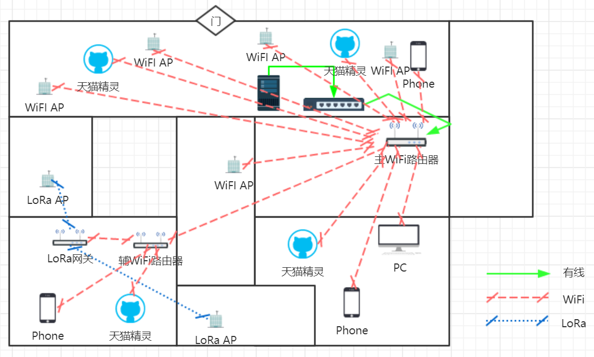
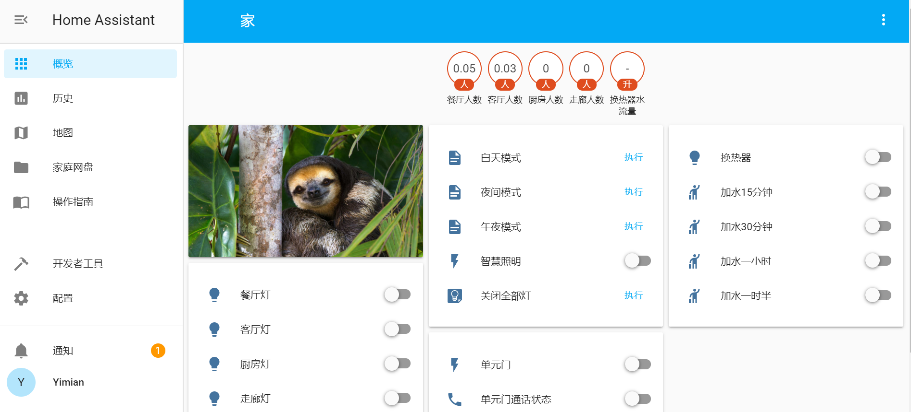
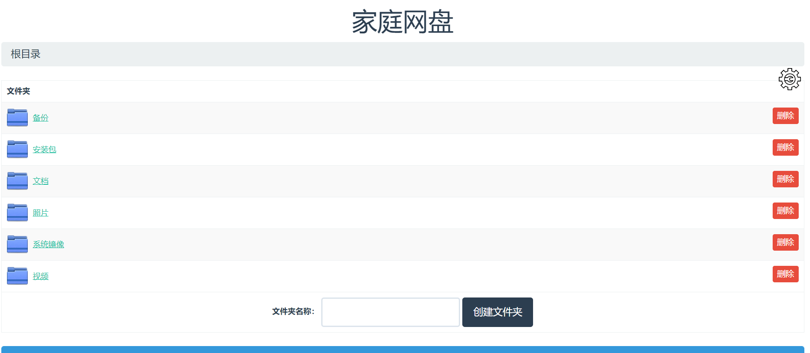

# Sola

IoTcat家中的智慧家庭系统

[English Version](./README.md)

##  硬件设计

###  单片机选材
使用Arduino UNO作为计算单元。一方面，Arduino Uno拥有高可靠性，我之前的智慧窗帘系统使用Arduino Uno作为主控板，平稳运行1年半未出现硬件问题。另一方面，Arduino Uno拥有较大的RAM，无需为了争夺RAM而在单片机编程上煞费苦心。

Arduino UNO的缺陷主要是价格高，但是为保障长期稳定运行，这个成本是必要的。

###  WiFi通信模块选材

使用ESP-01作为WiFi的通信模块。主要原因是之前学校课程使用过ESP-01搭建遥控小车，对其工作方式和性能比较了解，降低开发成本。

###  LoRa通信模块选材

使用**安信可 LORA RA-02 LORA**作为LoRa节点和LoRa网关通信模块。原因是surf项目使用的就是这个模块，比较了解它。

###  智能音箱选材

智能音箱作为此物联网系统人机交互的最主要界面，发挥着举足轻重的作用。经研究，我使用天猫精灵方糖R作为家用智能音箱。一方面，天猫精灵的性价比摆在那里，非常便宜。第二，与小米开发小爱同学不同，阿里开发天猫精灵的目的是提供平台，它允许开发者以各种形式接入其网络，这一点对我至关重要。

###  灯拨动开关

初期设想: 单向控制+复位器。
实际实现：将原有单开改造为双开，一路与继电器串联，另一路与两个pin口相连。

##  通信设计

采用WiFi+LoRa两种通信模式。在需要高速高质量通信的场景，如天猫精灵，手机，笔记本，使用WiFi作为通信手段。在WiFi信号不稳定的地方，使用LoRa进行通信。使用MQTT为应用层协议。

##  主控系统设计

使用python3开源项目Home Assistant 为基础搭建本项目的主控系统。效果如下图：

##  多媒体系统设计

多媒体主要由天猫精灵提供。此外，通过小米盒子，家庭网盘中的视频，图片，音乐实现了电视与音响上的播放。

##  云端支持系统设计

dns.yimian.xyz提供dns解析服务。

##  NAS存储系统设计

通过挂载从老电脑上拆卸的闲置500G机械硬盘到老IBM服务器，实现存储系统的搭建。
对局域网内，由于家里都是win系统，使用smb作为共享协议实现文件传输，支持局域网内挂载。速度稳定，全网读写10MB/s左右。对外网访问，通过http，frp反代实现，但速度较慢。

以下是对网页界面的一个截屏：

